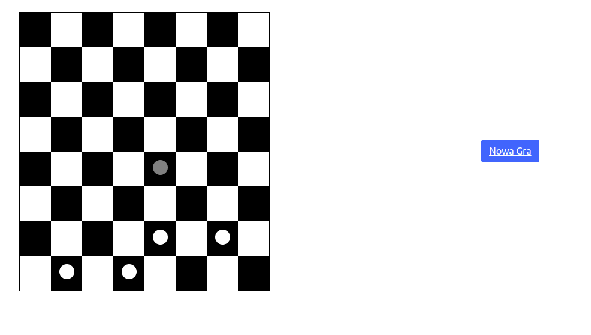

# WolfAndSheep

# Project Name
WolfAndSheep

## Table of Contents
* [General Info](#general-information)
* [Technologies Used](#technologies-used)
<!-- * [Features](#features) -->
<!-- * [Screenshots](#screenshots)
* [Setup](#setup)
* [Usage](#usage) -->
* [Project Status](#project-status)
* [Room for Improvement / To Do](#room-for-improvement)
<!-- * [Acknowledgements](#acknowledgements) -->
* [Contact](#contact)

## General Information
- Game made as a project for university 

## Technologies Used
- Python 3.9
- Flask
- HTML
- CSS

## Features
List the ready features here:
- 1-on-1 game with a computer (~artificial intelligence/rule-based system)
- hot-seat - a game of 1-on-1 (or more players) at a single computer
- multiplayer - a game played by many players on different computers

<!-- ## Screenshots

<!-- If you have screenshots you'd like to share, include them here. -->

<!-- ## Setup
What are the project requirements/dependencies? Where are they listed? A requirements.txt or a Pipfile.lock file perhaps? Where is it located?

Proceed to describe how to install / setup one's local environment / get started with the project.

## Usage
How does one go about using it?
Provide various use cases and code examples here.

 -->
## Project Status
Project is: _in progress_

## Room for Improvement / To Do
<!-- Include areas you believe need improvement / could be improved. Also add TODOs for future development.
Room for improvement:
- Improvement to be done 1
- Improvement to be done 2
 -->
<!-- To do:
- 1-on-1 game with a computer (~artificial intelligence/rule-based system)
- hot-seat - a game of 1-on-1 (or more players) at a single computer
- multiplayer - a game played by many players on different computers -->

<!-- ## Acknowledgements
Give credit here.
- This project was inspired by...
- This project was based on [this tutorial](https://www.example.com).
- Many thanks to...
 -->
 
## Contact
Created by Karol Kijowski
